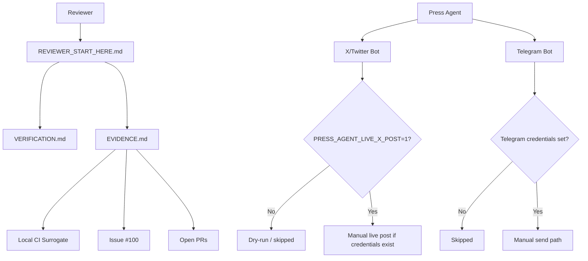

# Quantum Pi Forge Architecture Map

This document gives reviewers a 10-minute orientation to the repository.

Current sealed baseline: `da1c8a3`

## Review Status Legend

| Status | Meaning |
|---|---|
| LIVE | Public-facing or deployed component. |
| SEALED | Present but intentionally frozen for review. |
| EXPERIMENTAL | Research/prototype area, not production-authorized. |
| INACTIVE | Code exists but lacks credentials/configuration or is not enabled. |
| DEPRECATED | Historical or superseded artifact. |

## Component Status

| Component | Path | Status | Notes |
|---|---|---:|---|
| Reviewer entry point | `REVIEWER_START_HERE.md` | SEALED | Main orientation file for external reviewers. |
| Verification docs | `VERIFICATION.md` | SEALED | Baseline/proof references. |
| Official channels | `OFFICIAL_CHANNELS.md` | LIVE | Public communications boundary. |
| Press agent | `press-agent/` | INACTIVE | Communications tooling; X live posting is manually gated. |
| X/Twitter bot | `press-agent/src/bots/twitter.js` | INACTIVE | Requires credentials and `PRESS_AGENT_LIVE_X_POST=1`. |
| Telegram bot | `press-agent/src/bots/telegram.js` | INACTIVE | Requires `TELEGRAM_BOT_TOKEN` and `TELEGRAM_CHAT_ID`. |
| Runtime / workers | `workers/`, `runtime/` | SEALED | No autonomous activation during review. |
| Contracts | `contracts/` | SEALED | Reviewable code surface; no new deployment expansion. |
| Scripts | `scripts/` | SEALED | Local verification only unless explicitly documented. |

## High-Level Flow

## Review Boundary

During sealed review, the following remain unauthorized:

* Autonomous runtime activation
* Wallet signing
* Deployment expansion
* Governance execution
* Financial automation
* Telegram activation
* Ungated X/Twitter live posting
